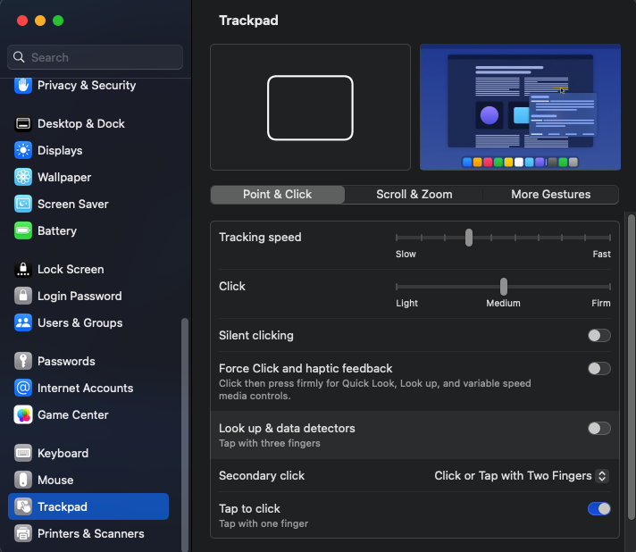

# Lenovo L380 OpenCore EFI

| Category | Description |
| ---- | ---- |
| Model | Lenovo ThinkPad L380 Yoga |
| Variant | 20M8S29200 |
| BIOS | **UEFI**: RORET52W (1.35) **Embedded Controller**: RORHT32W (1.15) |
| CPU | Intel Core i5 8250U |
| RAM | 16 GB:  - 8 GB Samsung DDR 4 @2666 Mhz (soldered) - 8 GB Samsung DDR 4 @2666 Mhz (RAM Slot) |
| Storage | INTEL SSDPEKKF256G8L (256 GB NVMe SSD) |
| Display | Full HD (1080p) |
| iGPU | Intel(R) Graphics UHD 620 |
| dGPU | None |
| Camera | HD720p camera |
| Audio | Realtek ALC3287 |
| Thunderbolt | None |
| Ethernet | None (optional USB Type-C to Ethernet adapter available) |
| Wi-Fi | Intel 8265 / 8275 |
| Bluetooth | Bluetooth 4.2 |
| Trackpad | Elan touchpad |
| SD Card Reader | MicroSD card reader |
| Dock | None |
| Ports | - 2 x USB 3.1 Gen 1 (one Always On) - 2 x USB 3.1 Type-C Gen 1 (with the function of Power Delivery and DisplayPort) - 1 x HDMI 1.4b - 1 x Headphone / microphone combo jack (3.5mm) - 1 x Kensington lock slot |

	
Trackpad Settings

	

		
		
		
	

